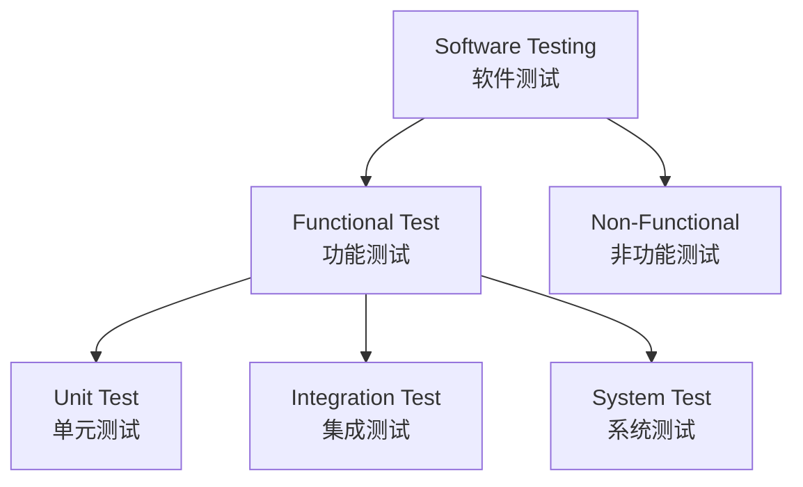

## 1. Программирование на Python <br> Python 编程

<a id="1-списковые-включения-и-генераторы--列表推导式与生成器-list-comprehension-and-generator"></a>

### 1. Списковые включения и генераторы <br> 列表推导式与生成器（List Comprehension and Generator）

Python 推导式（comprehension；включение）是一种根据已有可迭代对象（iterable）快速创建新数据结构的方法，从一个数据序列构建另一个新的数据序列，用一行代码完成循环、条件判断与数据转换。它适用于生成列表（list）、字典（dict）、集合（set）和生成器（generator）。

---

列表推导式基本结构如下：

```python

[expression   for   item  in  iterable]
 ↑             ↑      ↑           ↑
结果如何生成  循环   当前元素    数据来源    
```

例如生成 1~10 的平方数：

```python
result=[
    x*x
    for x in range(1,11) # range 右边界不会被遍历到，故应设为 N+1
]
```

---


在以上基本结构的基础上，可以加入 `if` 条件过滤，形式如下：

```python
[expression for item in iterable if condition]
```

例如使用列表推导式得到10以内的偶数可以这样表示：

```python
even=[
    x
    for x in range(10)
    if x%2==0
]
```

得到输出结果`[0,2,4,6,8]`

---

除此之外，还可以使用 `if-else` 语句，形式如下：

```python
[value_if_true if condition else value_if_false for item in iterable]
```

例如，将数字分为奇数和偶数可以这样表示：

```python
result=[
    "even" if x%2==0 else "odd"
    for x in range(5)
]
```

得到结果：

```python
[
    'even',
    'odd',
    'even',
    'odd',
    'even'
]
```

---

列表推导式还可以进行嵌套，例如：

```python
matrix=[
    [1,2],
    [3,4]
]

result=[
    x*x
    for row in matrix
    for x in row
]
```

得到`result=[1,4,9,16]`

---

集合推导式与列表推导式相比，使用大括号`{}`进行包围，其语法如下：

```python
{expression for item in iterable}
```

由于集合的特性，不存在元素重复，因此我们可以使用集合推导式对列表元素自动去重，例如：

```python
numbers=[
    1,2,2,3,3
]

unique={
    x
    for x in numbers
}
```

得到结果：

```python
{1,2,3}
```

---

字典推导式可用于快速创建字典，其语法如下：

```python
{
    key:value
    for item in iterable
}
```

例如创建数字平方表：

```python
squares={
    x:x*x
    for x in range(5)
}
```

或字典交换：

```python
student={
    "Tom":20,
    "Bob":21
}

exchange={
    age:name
    for name,age in student.items()
}
```

---

生成器表达式用于生成一个生成器，其语法如下：

```python
generator=(
    x*x
    for x in range(1000000)
)
```

> 需要注意的是，生成器表达式虽然使用元组tuple所使用的小括号`()`表示，但得到是生成器，记录的是元素生成规则，而并非元组，Python 不存在元组推导式

当我们使用列表推导式时，在运行阶段，程序会直接立即计算全部列表数值并占用内存，当列表元素过多时，可能会造成内存溢出，而生成器表达式则仅仅记录元素的生成规则，并且只在调用 `next()` 方法时，才完成一次计算，返回单一元素结果，对内存占用低。

---

迭代器（Iterator）是一个可以保存当前遍历状态，并且能够返回下一个元素的对象。

迭代器对象从集合的第一个元素开始访问，直到所有的元素被访问完结束。迭代器只能往前不会后退。

迭代器有两个基本的方法：
- `__iter__()` 返回迭代器自身
- `__next__()` 返回下一个元素，当没有下一个元素时，抛出 `StopIteration` 异常。

而可以被迭代器迭代的对象则称之为可迭代对象（iterable；итерируемый объект）。可迭代对象本身通常没有 `__next__()` 方法，但可以通过 `__iter__()` 方法获得用于遍历自身的迭代器。

在 Python 中，list 列表，tuple 元组，string 字符串，dict 字典，set 集合，range 范围均属于可迭代对象，可以被迭代器遍历。

例如：

```python
numbers=[10,20,30]

iterator=iter(numbers)

print(next(iterator))
```

其中，列表 `numbers` 为可迭代对象，`iterator` 为 `numbers` 的迭代器

---

生成器（generator；генератор）是一种特殊的迭代器，用于惰性地产生序列。迭代器必须实现迭代器协议（Iterator Protocol；протокол итератора），即提供 `__iter__()` 和 `__next__()` 方法；生成器通常通过包含 `yield` 的函数或生成器表达式创建，Python 会自动为其实现该协议。

`yield` 关键字类似于普通函数中的 `return` 用于返回函数值，不同的是 `yield` 会在返回当前值时，会保存函数当前的执行状态，当函数下一次调用，会从当前状态继续执行。

例如以下函数定义了一个生成器：

```python
def countdown(n):
    while n > 0:
        yield n
        n -= 1 # 等价于 n = n - 1
 
# 创建生成器对象
generator = countdown(5)
 
# 通过迭代生成器获取值
print(next(generator))  # 输出: 5
print(next(generator))  # 输出: 4
print(next(generator))  # 输出: 3
 
# 使用 for 循环迭代生成器
for value in generator:
    print(value)  # 输出: 2 1
```

> 需要注意的是，直接调用生成器函数本身并不会执行函数内部的代码，而是生成一个该生成器的对象，如果要执行函数代码，需要调用 `next()` 方法

<a id="2-декораторы-и-контекст-менеджеры--装饰器与上下文管理"></a>

### 2. Декораторы и контекст-менеджеры <br> 装饰器与上下文管理器（Decorator and Context Manager）

在 Python 中，函数也是一种对象，可以被赋值，可以作为参数传递，也可以作为返回值返回。装饰器（Decorator；декоратор）正是利用这一特性，在不改变被装饰函数源码的前提下包装并扩展其行为。

例如以下 `say_name()` 函数被赋值给 `func`，调用 `func` 输出 `"Anton"`：

```python
def say_name(name):
    print(name)

func = say_name

func("Anton")
```

而以下用例则将函数 `say_name()` 作为参数传递给函数 `greet()` 并调用执行，最终输出 `Hello! Anton`：

```python
def say_name(name):
    print(name)

def greet(func):
    print("Hello!", end=' ')
    func("Anton")

greet(say_name)
```

---

结合以上特性，我们便得到了 Python 中的装饰器（Decorator）。**装饰器的本质是一个接收函数作为参数，并返回一个新函数的函数**。通过装饰器，我们可以在不修改原函数的情况下，动态扩展原函数的功能。

将上述的用例改用装饰器表达如下，最终同样输出 `Hello! Anton`：

```python
from functools import wraps

def greet(func):
    @wraps(func)
    def wrapper(*args, **kw):
        print("Hello!", end=' ')
        return func(*args, **kw)
    return wrapper

@greet
def say_name(name):
    print(name)

say_name("Anton")
```

在上面的程序中，`greet` 是一个装饰器，在 Python 中使用 `@` 符号修饰于原函数的上方，而在 `say_name` 函数定义处上方添加 `@greet`，相当于执行了语句：

```python
say_name = greet(say_name)
```

而对于 `say_name()` 的参数，则通过 `wrapper()` 函数的 `(*args, **kw)` 进行传递，该方式可以接受任意位置参数和关键字参数。生产代码中应使用 `functools.wraps`：它保留原函数的 `__name__`、文档字符串和签名元数据，避免日志、调试器与测试框架把函数误识别为 `wrapper`；包装器也应 `return func(...)`，否则原函数的返回值会丢失。

---

而如果需要让装饰器本身也引入参数，则可以在装饰器外围再套一层高阶函数，例如：

```python
def repeat(times):
    def greet(func):
        def wrapper(*args, **kw):
            for _ in range(times):
                print("Hello!", end=' ')
                func(*args, **kw)
        return wrapper
    return greet

@repeat(3)
def say_name(name):
    print(name)

say_name("Anton")
```

最终输出：

```python
Hello! Anton
Hello! Anton
Hello! Anton
```

---

除此之外，装饰器外也可以嵌套装饰器，例如：

```python
def decorator1(func):
    def wrapper():
        print("Decorator 1 before")
        func()
        print("Decorator 1 after")
    return wrapper

def decorator2(func):
    def wrapper():
        print("Decorator 2 before")
        func()
        print("Decorator 2 after")
    return wrapper

@decorator1
@decorator2
def hello():
    print("Hello")
```

该写法在执行时等价于

```python
hello = decorator1(decorator2(hello))
```

此时再调用 `hello()`，其执行过程如下：

```python
decorator1.wrapper()
    ↓
print("Decorator 1 before")
    ↓
decorator2.wrapper()
    ↓
print("Decorator 2 before")
    ↓
hello()
    ↓
print("Hello")
    ↓
print("Decorator 2 after")
    ↓
print("Decorator 1 after")
```

---

由于在 Python 中，类也和函数一样是一个对象，因此装饰器除了可以作用于函数，也可以作用于类。通过类装饰器，我们可以扩展类的方法和属性，控制实例化过程

例如我们有一个 `Student` 类，我们可以使用函数形式的类装饰器 `extend_class()` 对扩展一个 `age` 属性，并对 `introduce()` 方法进行扩展：

```python
def extend_class(cls):
    # 获取原有的初始化方法
    old_init = cls.__init__ 
    # 扩展原有的初始化方法
    def new_init(self, name="", age=0): 
        old_init(self, name)
        self.age = age
    # 替换原有的初始化方法
    cls.__init__ = new_init 

    # 获取原有的 introduce() 方法
    old_introduce = cls.introduce 
    # 扩展原有的 introduce() 方法
    def new_introduce(self): 
        print("Hello! My name is", end=" ")
        old_introduce(self)
        print("I am " + str(self.age) + " years old")

    # 替换原有的 introduce() 方法
    cls.introduce = new_introduce 

    return cls

@extend_class
class Student:
    def __init__(self, name=""):
        self.name=name

    def introduce(self):
        print(self.name)

anton = Student("Anton", 12)
```

现在调用 `anton.introduce()`，则会输出：

```
Hello! My name is Anton
I am 12 years old
```

---

上述以函数形式实现的类装饰器直接对原类进行了修改，破坏了原有 `Student` 类的实现，如果需要避免这一点，我们可以引入包装类作为代理进行扩展：

```python
def extend_class(cls):
    class Wrapper:
        def __init__(self, *args, age=0, **kwargs):
            # 创建原始对象
            self.wrapped = cls(*args, **kwargs)
            # 添加新属性
            self.age = age

        def __getattr__(self, name):
            # 转发未知属性给原始对象
            return getattr(self.wrapped, name)

        def introduce(self):
            print("Hello! My name is", end=" ")
            self.wrapped.introduce()
            print("I am " + str(self.age) + " years old")

    return Wrapper

@extend_class
class Student:
    def __init__(self, name=""):
        self.name=name

    def introduce(self):
        print(self.name)

anton = Student("Anton", 12)
```

---

除了函数形式的类装饰器，还有类形式的类装饰器，同样对于 `Student` 类，我们可以使用以下类装饰器进行扩展：

```python
class ExtendClass:
    def __init__(self, cls):
        self.cls = cls
        old_init = cls.__init__

        def new_init(instance,name="",age=0):
            old_init(instance,name)
            instance.age=age

        cls.__init__ = new_init

        old_introduce = cls.introduce

        def new_introduce(instance):
            print("Hello! My name is", end=" ")

            old_introduce(instance)

            print("I am " + str(instance.age) + " years old")

        cls.introduce = new_introduce

    def __call__(self,*args,**kwargs):

        return self.cls(*args,**kwargs)

@ExtendClass
class Student:
    def __init__(self, name=""):
        self.name=name

    def introduce(self):
        print(self.name)

anton = Student("Anton", 12)

anton.introduce()
```

---

同样，使用包装类的版本如下：

```python
class ExtendClass:
    def __init__(self, cls):
        # 保存原始类
        self.cls = cls

    def __call__(self, *args, age=0, **kwargs):
        # 创建包装对象
        return Wrapper(self.cls,*args,age=age,**kwargs)

class Wrapper:
    def __init__(self, cls, *args, age=0, **kwargs):
        # 创建原始对象
        self.wrapped = cls(*args, **kwargs)
        # 添加新的属性
        self.age = age

    def __getattr__(self, name):
        # 将未找到的属性转发给原始对象
        return getattr(self.wrapped, name)

    def introduce(self):
        print("Hello! My name is", end=" ")
        self.wrapped.introduce()
        print("I am " + str(self.age) + " years old")

@ExtendClass
class Student:
    def __init__(self, name=""):
        self.name = name

    def introduce(self):
        print(self.name)

anton = Student("Anton", age=12)

anton.introduce()
```

---

除此之外，Python 还内置了一些常用的装饰器：

- `@staticmethod`：用于定义类的静态方法、
- `@classmethod`：用于定义类方法
- `@property`：用于将方法变为属性

例如：

```python
class MyClass:
    @staticmethod
    def static_method():
        print("静态方法")

    @classmethod
    def class_method(cls):
        print(cls.__name__)

    @property
    def name(self):
        return self._name

    @name.setter
    def name(self, value):
        self._name = value
```

---

在 Python 中，上下文管理（Context Management）是一种用于管理资源生命周期的机制，可用于管理文件、数据库连接、网络连接、线程等资源。

例如，在传统方式中，手动管理文件资源如下：

```python
def get_content(filename):
    file = open(filename, "r")
    content = file.read()
    file.close()

    return content
```

上述代码存在一个潜在问题：如果函数在执行 `file.read()` 的过程中发生异常，例如文件读取失败或程序抛出异常，那么程序会立即跳出当前执行流程，而后续的 `file.close()` 将不会被执行，造成资源泄漏

为了保证资源能够在任何情况下被正确释放，可以使用 `try...finally` 结构：

```python
def get_content(filename):
    file = open(filename, "r")
    try:
        content = file.read()
        return content
    finally:
        file.close()
```

无论 `try` 代码块是否正常执行，`finally` 中的代码都会被执行，因此可以保证文件资源被释放。

然而在实际开发中，如果对于每一种资源都手动编写 `try...finally`，会产生大量重复样板代码，不易于开发维护

因此 Python 提供了上下文管理协议（Context Management Protocol），该协议要求对象实现两个方法：

- `__enter__()`：进入上下文时调用，返回值赋给 `as` 后的变量
- `__exit__()`：退出上下文时调用，处理清理工作

上下文管理协议的 `__exit__()` 方法接收三个参数：

- `exc_type`：异常类型
- `exc_val`：异常值
- `exc_tb`：异常追踪信息

如果 `__exit__()` 返回 `True`，则表示异常已被处理，不会继续传播；返回 `False` 或 `None`，异常则会继续向外传播。

在实际开发中，可以通过 `with` 关键字自动管理资源生命周期，上述代码于是可以简化为：

```python
def get_content(filename):
    with open(filename, "r") as file:
        content = file.read()
    return content
```

在这里 `with` 后面的表达式返回的对象必须是一个上下文管理器（Context Manager），而 `open()` 返回的文件对象（file object）正是一个实现了上下文管理协议（Context Management Protocol）的对象，因此可以直接用于 `with` 语句。

当程序进入 `with` 代码块时，Python 会自动调用上下文管理器 `open()` 的 `__enter__()` 方法，执行代码块，并在离开时自动调用 `__exit__()` 方法释放资源，即使发生异常，资源也会被自动关闭

---

除了使用 `with` 关键字，我们也可以通过自定义类实现上下文管理协议的 `__enter__()` 和 `__exit__()` 方法创建自定义的上下文管理器，例如以下基于上下文管理器实现的计时器：

```python
import time

class Timer:
    def __enter__(self):
        import time
        self.start = time.time()
        return self

    def __exit__(self, exc_type, exc_val, exc_tb):
        import time
        self.end = time.time()
        print(f"cost: {self.end - self.start:.2f} second")
        return False # 注意不要忽略 exit 的返回值造成异常处理出现问题

# 对代码执行时间进行计时
with Timer() as t:
    # 执行一些耗时操作
    time.sleep(1)
```

---

然而对于很多简单场景，手动定义一个类会显得比较繁琐。为此，Python 还提供了 `contextlib` 包以简化上下文管理：

```python
from contextlib import contextmanager

@contextmanager
def context():
    # 进入 with 之前执行的代码，等价于 __enter__()
    yield resource # yield 返回的值，等价于 __enter__() 的返回值
    # 离开 with 之后执行的代码，正常情况下对应__exit__()
```

当 `with` 块抛出异常时，`contextmanager` 会把异常重新注入到 `yield` 位置。因此若清理动作必须执行，应把 `yield` 放在 `try...finally` 中；只有明确处理该异常时才可在生成器内捕获并抑制它。

以上基于上下文管理器实现的计时器使用 `contextlib` 实现如下：

```python
import time
from contextlib import contextmanager

@contextmanager
def Timer():

    # 进入 with 之前执行
    start = time.time()

    try:
        # 将控制权交给 with 代码块
        yield
    finally:
        # 无论 with 块是否抛出异常，均执行清理/记录动作
        end = time.time()
        print(f"cost: {end - start:.2f} second")

# 对代码执行时间进行计时
with Timer():
    # 执行一些耗时操作
    time.sleep(1)
```

<a id="3-типизация-и-статическая-проверка--类型注解于静态类型检查"></a>

### 3. Типизация и статическая проверка <br> 类型注解与静态类型检查（Type Hints and Static Type Checking）

Python 是一种动态类型语言（Dynamically Typed Language；язык с динамической типизацией），变量的类型不需要提前声明，而是在运行过程中动态确定，并且同一个变量的类型可能随运行场景改变。这简化了程序设计，但在工程场景下也会带来接口歧义与维护风险。

例如以下代码既可以用于数字相加，也可以用于字符串拼接，导致用法不统一：

```python
def add(a, b):
    return a + b
```

为此，Python 提供了类型注解（Type Hints；аннотации типов）用以标注变量、函数参数和返回值的类型，其中变量和参数在其名称后使用 `:` 后接类型表示，函数返回值在函数声明后使用 `->` 后接类型表示。

于是上述 `add()` 函数可以使用类型注解表示为：

```python
def add(a: int, b: int) -> int:
    return a+b
```

需要注意的是，Python 的类型注解不同于 C/Java 语言的强类型检查，没有改变 Python 的动态类型的机制，也不会对变量本身的类型进行强制限制，只是提供了类型提示以及静态检查的功能，因此 `add("hello", "world")` 仍然可以正常执行并返回 `helloworld`

---

除了对基础的变量，参数和函数返回值进行类型标注，也可以引入 `typing` 模块对列表、字典等容器类型进行标注：

```python
from typing import List, Dict, Tuple, Set

# List[int] 表示这是一个只包含整数的列表
numbers: List[int] = [1, 2, 3, 4, 5]

# Dict[str, int] 表示这是一个键为字符串、值为整数的字典
student_scores: Dict[str, int] = {"Alice": 95, "Bob": 88}

# Tuple[int, str, bool] 表示这是一个包含整数、字符串、布尔值的元组
person_info: Tuple[int, str, bool] = (25, "Alice", True)

# Set[str] 表示这是一个只包含字符串的集合
unique_names: Set[str] = {"Alice", "Bob", "Charlie"}
```

`typing` 还提供了以下复杂类型标注功能：

- 联合类型（Union）：当值可能是多种类型之一时使用
  
  ```python
  from typing import Union

  def process_input(data: Union[str, int, List[int]]) -> None:
      """处理可能是字符串、整数或整数列表的输入"""
      if isinstance(data, str):
          print(f"字符串: {data}")
      elif isinstance(data, int):
          print(f"整数: {data}")
      elif isinstance(data, list):
          print(f"列表: {data}")

  process_input("hello")    # 输出：字符串: hello
  process_input(42)         # 输出：整数: 42  
  process_input([1, 2, 3])  # 输出：列表: [1, 2, 3]
  ```

- 可选类型（Optional）：当值可能是某种类型或者是 None 时使用

  ```python
  from typing import Optional

  def find_student(name: str) -> Optional[str]:
      """根据名字查找学生，可能找到也可能返回None"""
      students = {"Alice": "A001", "Bob": "B002"}
      return students.get(name)  # 可能返回字符串或None

  # 等价于 Union[str, None]
  ```

---

而当类型很复杂时，例如我们要标注一个二维坐标列表的类型时，可以使用类型别名（Type Alias；псевдоним типа）。在 Python 3.9 及以上版本，优先使用内置容器泛型；`list[int]` 与旧写法 `typing.List[int]` 对静态检查表达的含义相同，但前者是现代推荐写法。Python 3.10 及以上还可用 `str | None` 替代 `Optional[str]`。

```python
Coordinate = tuple[float, float]
Route = list[Coordinate]

def distance(points: Route, label: str | None = None) -> float:
    return 0.0
```

静态类型检查器（Static Type Checker；статический анализатор типов）只在分析阶段报告不一致，运行时不会自动验证数据。对于边界输入，例如 JSON、HTTP 请求或用户输入，仍要显式校验；类型注解不能替代验证。

---

对于静态类型检查，Python 提供了 `Mypy` 工具，我们需要首先安装它：

```
pip install mypy
```

对于存在潜在类型问题的 Python 文件：

```python
# example.py
def add_numbers(a: int, b: int) -> int:
    return a + b

result = add_numbers("5", "3")  # 这里有问题！传入了字符串
```

可以运行 mypy 检查

```
mypy example.py
```

会得到类似这样的输出，提示类型错误：

```python
example.py:4: error: Argument 1 to "add_numbers" has incompatible type "str"; expected "int"
example.py:4: error: Argument 2 to "add_numbers" has incompatible type "str"; expected "int"
Found 2 errors in 1 file (checked 1 source file)
```

现代集成开发环境工具，大部分已经内置了类型检查支持，自动提供错误高亮提示以及智能补全建议


---

<a id="4-асинхронность-asyncio--异步编程"></a>

### 4. Асинхронность (asyncio) <br> 异步编程（Asynchronous Programming；асинхронное программирование）

程序执行通常有两种方式：同步（synchronous；синхронный）和异步（asynchronous；асинхронный）。

同步程序按照代码顺序一步一步执行，例如以下模拟烹饪的程序

```python
import time

def prepare_ingredients(ingredients): # 备菜
    print("Begin preparing ingredients")
    time.sleep(200)
    print("Ingredients are prepared")
    return "prepared " + ingredients

def boil_water(water): # 烧水
    print("Begin boiling water")
    time.sleep(300)
    print("Water is ready")
    return "hot " + water

def cooking(): # 烹饪
    prepare_ingredients("")
    boil_water("water")
```

执行过程

```python
开始备菜 prepare_ingredients
    ↓
等待200秒
    ↓
完成备菜 prepare_ingredients
    ↓
开始烧水 boil_water
    ↓
等待300秒
    ↓
完成烧水
```

总时间约为 $500$ 秒；等待期间当前执行流被阻塞，无法继续执行后续代码。这种由等待输入输出操作导致的等待称为 I/O 阻塞（Input/Output Blocking, I/O Blocking；блокировка ввода-вывода）。

常见的 I/O 阻塞包括：

- 网络 I/O：如 HTTP 请求、API 调用、下载文件、WebSocket
  ```python
  response = requests.get(url)
  ```
- 文件 I/O：文件读写等
  ```python
  data=open("large_file.txt").read()
  ```
- 数据库 I/O：增删查改等操作
  ```python
  result = database.query()
  ```
- ...

这些操作往往其等待时间远大于 CPU 计算时间，长时间的空闲等待会拖慢整个流程的执行效率

而异步编程（asyncio）则主要解决这种 I/O 阻塞问题，通过在 I/O 等待期间切换任务，提高单线程处理大量 I/O 操作的效率。

对此，Python 提供了 `asyncio` 包以实现异步编程，它提供了以下核心概念：协程（Coroutine），事件循环（Event Loop），任务（Task）与未来对象（Future）用于实现单线程异步并发

1. 协程（Coroutine）：协程是一种特殊函数，可以在执行过程中暂停，保存状态并在稍后恢复执行。协程通过 `async def` 关键字定义，并通过 `await` 关键字暂停执行，等待异步操作完成。
   
   ```python
   import asyncio

   async def boil_water(water): # 烧水
       print("Begin boiling water")
       await asyncio.sleep(300)
       print("Water is ready")

   asyncio.run(boil_water("water"))
   ```
2. 异步任务（Task）：当程序需要同时运行多个协程时，需要将协程封装为任务，即协程的包装对象，它将协程注册到事件循环中，使事件循环能够调度它。我们可以通过 `asyncio.create_task()` 函数创建 Task，并将其添加到事件循环中
   
   ```python
   async def cook():
       boil_water1 = asyncio.create_task(boil_water("300 ml water"))
       boil_water2 = asyncio.create_task(boil_water("another 300 ml water"))

       await boil_water1
       await boil_water2
   
   asyncio.run(cook())
   ```
   
3. 事件循环（Event Loop）：事件循环是 `asyncio` 的核心调度机制，负责管理所有 Task 任务，检查异步操状态，恢复已经完成等待的任务并调度可以继续执行的任务。它相当于一个任务调度器，当某个 Task 因为 await 等待 I/O 操作而暂停时，事件循环会将控制权交给其他处于 Ready 状态的 Task；当等待操作完成后，再恢复原 Task 的执行。
   
   ```python
              Event Loop
                  |
      -------------------------
      |           |           |
   Task A      Task B      Task C
      |
   await等待
      |
   切换执行其他就绪Task
   ```

4. 未来对象（Future）：Future 是 `asyncio` 中用于表示异步操作结果的对象，相当于一个结果占位符，在异步操作开始时，Future 处于 `Pending` 状态；当异步操作完成后，可以通过 `set_result()` 保存结果，或者通过 `set_exception()` 保存异常。其他协程可以通过 `await` 等待 Future 完成并获取最终结果。
   
   > 在实际开发中，Future 通常由底层框架创建和管理，而开发者更多使用 Task。Task 本身继承自 Future，用于封装和调度 Coroutine。
   
   ```python
   async def cook():
       meal = asyncio.Future()
       meal.set_result("Meal is ready")
       result = await meal
   ```

通过结合上述概念，我们可以以异步方式实现最初的例子：

```python
import asyncio

async def prepare_ingredients(ingredients): # 备菜
    print("Begin preparing ingredients")
    await asyncio.sleep(200)
    print("Ingredients are prepared")

    return "prepared " + ingredients

async def boil_water(water):  # 烧水
    print("Begin boiling water")
    await asyncio.sleep(300)
    print("Water is ready")

    return "hot " + water

async def cook(meal):
    task_prepare_vegetable = asyncio.create_task(prepare_ingredients("vegetable"))
    task_boil_water = asyncio.create_task(boil_water("water"))

    vegetable = await task_prepare_vegetable
    water = await task_boil_water

    meal = meal + ": " + vegetable + ", " + water

    return meal

if __name__ == "__main__":
    results = asyncio.run(cook("Soup"))
    print(results)
```

最终输出

```
Begin preparing ingredients
Begin boiling water
Ingredients are prepared
Water is ready
Soup: prepared vegetable, hot water
```

对比最初同步版本约 $500$ 秒的耗时，两个等待操作重叠后总耗时约为 $300$ 秒。这里提高的是 I/O 密集任务的并发度、吞吐量或响应性，而不是让单个 CPU 密集计算更快；在协程中调用 `time.sleep()`、同步 `requests` 或长时间计算都会阻塞事件循环。CPU 密集任务应考虑进程池，阻塞 I/O 则应使用相应的异步库或 `asyncio.to_thread()`。

---

协程对象（Coroutine Object；объект сопрограммы）由调用 `async def` 函数得到，但在被 `await` 或封装为任务之前不会运行；任务（Task；задача）则由事件循环调度。需要并发等待一组协程时，`asyncio.gather()` 比逐一 `await` 更直接。默认情况下，任一子协程抛出的异常会使 `gather` 向调用者抛出异常；传入 `return_exceptions=True` 才会把异常作为结果返回，因此必须逐项检查。

```python
import asyncio

async def fetch(name: str, delay: float) -> str:
    await asyncio.sleep(delay)
    return name

async def main() -> None:
    first, second = await asyncio.gather(
        fetch("first", 1),
        fetch("second", 1),
    )
    print(first, second)

asyncio.run(main())
```

---

超时（Timeout；тайм-аут）和取消（Cancellation；отмена）是异步程序必须处理的控制流。`asyncio.wait_for(awaitable, timeout)` 超时后会取消其等待对象并抛出 `asyncio.TimeoutError`；协程在可取消的 `await` 点收到 `asyncio.CancelledError`。清理资源时应使用 `try...finally`，并且除非有充分理由，不要吞掉 `CancelledError`，否则上层无法停止任务。

```python
async def request_with_timeout() -> str:
    try:
        return await asyncio.wait_for(fetch("data", 2), timeout=1)
    except asyncio.TimeoutError:
        return "timeout"
```

<a id="5-файлы-и-форматы-данных--文件与数据格式"></a>

### 5. Файлы и форматы данных <br> 文件与数据格式（Files and Data Formats；файлы и форматы данных）

Python 中使用内置方法 `open()` 进行文件操作，并返回文件对象，其基本语法如下：

```python
open(file, mode='r')
```

其完整语法格式为：

```python
open(file, mode='r', buffering=-1, encoding=None, errors=None, newline=None, closefd=True, opener=None)
```

该方法可以接受以下参数：

参数说明:

- `file`: 必需，文件路径（相对或者绝对路径）。
- `mode`: 可选，文件打开模式
- `buffering`: 设置缓冲
- `encoding`: 编码格式，一般使用 utf8
- `errors`: 报错级别
- `newline`: 区分换行符
- `closefd`: 传入的 `file` 参数类型
- `opener`: 设置自定义开启器，开启器的返回值必须是一个打开的文件描述符。

其中文件打开模式 `mode` 包含以下几类：

| 模式 | 含义           |
| -- | ------------ |
| t | 文本模式 (默认)。 |
| x | 写模式，新建一个文件，如果该文件已存在则会报错。 |
| b | 二进制模式。 |
| + | 打开一个文件进行更新(可读可写)。 |
| r | 以只读方式打开文件。文件的指针将会放在文件的开头。这是默认模式。 |
| rb | 以二进制格式打开一个文件用于只读。文件指针将会放在文件的开头。这是默认模式。一般用于非文本文件如图片等。 |
| r+ | 打开一个文件用于读写。文件指针将会放在文件的开头。 |
| rb+ | 以二进制格式打开一个文件用于读写。文件指针将会放在文件的开头。一般用于非文本文件如图片等。 |
| w | 打开一个文件只用于写入。如果该文件已存在则打开文件，并从开头开始编辑，即原有内容会被删除。如果该文件不存在，创建新文件。 |
| wb | 以二进制格式打开一个文件只用于写入。如果该文件已存在则打开文件，并从开头开始编辑，即原有内容会被删除。如果该文件不存在，创建新文件。一般用于非文本文件如图片等。 |
| w+ | 打开一个文件用于读写。如果该文件已存在则打开文件，并从开头开始编辑，即原有内容会被删除。如果该文件不存在，创建新文件。 |
| wb+ | 以二进制格式打开一个文件用于读写。如果该文件已存在则打开文件，并从开头开始编辑，即原有内容会被删除。如果该文件不存在，创建新文件。一般用于非文本文件如图片等。 |
| a | 打开一个文件用于追加。如果该文件已存在，文件指针将会放在文件的结尾。也就是说，新的内容将会被写入到已有内容之后。如果该文件不存在，创建新文件进行写入。 |
| ab | 以二进制格式打开一个文件用于追加。如果该文件已存在，文件指针将会放在文件的结尾。也就是说，新的内容将会被写入到已有内容之后。如果该文件不存在，创建新文件进行写入。 |
| a+ | 打开一个文件用于读写。如果该文件已存在，文件指针将会放在文件的结尾。文件打开时会是追加模式。如果该文件不存在，创建新文件用于读写。 |
| ab+ | 以二进制格式打开一个文件用于追加。如果该文件已存在，文件指针将会放在文件的结尾。如果该文件不存在，创建新文件用于读写。 |

---

调用 `open()` 函数，返回得到的便是 `file` 对象，下表列出了 `file` 对象常用的函数：

| 序号 | 函数 | 说明 |
|---|---|---|
| 1 | `file.close()` | 关闭文件。关闭后文件不能再进行读写操作。 |
| 2 | `file.flush()` | 刷新文件内部缓冲，直接把内部缓冲区的数据立刻写入文件，而不是被动的等待输出缓冲区写入。 |
| 3 | `file.fileno()` | 返回一个整型的文件描述符(file descriptor FD 整型)，可以用在如os模块的read方法等一些底层操作上。 |
| 4 | `file.isatty()` | 如果文件连接到一个终端设备返回 `True`，否则返回 `False`。 |
| 5 | `file.next()` | 返回文件下一行。Python 3 中的 File 对象不支持 `next()` 方法。 |
| 6 | `file.read([size])` | 从文件读取指定的字节数，如果未给定或为负则读取所有。 |
| 7 | `file.readline([size])` | 读取整行，包括 `\n` 字符。 |
| 8 | `file.readlines([sizeint])` | 读取所有行并返回列表，若给定 `sizeint>0`，返回总和大约为`sizeint` 字节的行，实际读取值可能比 `sizeint` 较大，因为需要填充缓冲区。 |
| 9 | `file.seek(offset[, whence])` | 移动文件读取指针到指定位置 |
| 10 | `file.tell()` | 返回文件当前位置。 |
| 11 | `file.truncate([size])` | 从文件的首行首字符开始截断，截断文件为 `size` 个字符，无 `size` 表示从当前位置截断；截断之后后面的所有字符被删除，其中 windows 系统下的换行代表2个字符大小。 |
| 12 | `file.write(str)` | 将字符串写入文件，返回的是写入的字符长度。 |
| 13 | `file.writelines(sequence)` | 向文件写入一个序列字符串列表，如果需要换行则要自己加入每行的换行符。 |

---

实际读写文本应优先使用上下文管理器（Context Manager；менеджер контекста）和显式编码，确保异常发生时文件也会关闭，并避免不同系统默认编码不一致。路径（Path；путь）建议用标准库 `pathlib.Path` 表示；它能跨平台地拼接路径，而不是手写 `"/"` 或 `"\\"`。文本模式下 `read(size)` 的 `size` 按字符计，二进制模式下通常按字节计；不要对大文件直接调用无参数的 `read()`，应按行或分块处理。

```python
from pathlib import Path

path = Path("data") / "students.txt"
with path.open("r", encoding="utf-8") as file:
    for line in file:
        print(line.rstrip("\n"))

with path.open("w", encoding="utf-8", newline="\n") as file:
    file.write("Alice\n")
```

---

JSON（JavaScript Object Notation, JSON；нотация объектов JavaScript）适合交换由对象、数组、字符串、数值、布尔值和空值组成的结构化数据。使用 `json.load()` / `json.dump()` 操作文件对象，`json.loads()` / `json.dumps()` 操作字符串；Python 元组、集合、自定义对象不能被 JSON 直接无损表示。CSV（Comma-Separated Values, CSV；значения, разделённые запятыми）适合二维表格数据，应使用 `csv` 模块而不是自行用 `split(',')`，因为字段可能含引号、逗号或换行。

```python
import csv
import json
from pathlib import Path

with Path("student.json").open("w", encoding="utf-8") as file:
    json.dump({"name": "Антон", "age": 20}, file, ensure_ascii=False)

with Path("students.csv").open("w", encoding="utf-8", newline="") as file:
    writer = csv.DictWriter(file, fieldnames=["name", "age"])
    writer.writeheader()
    writer.writerow({"name": "Антон", "age": 20})
```

读取外部数据时要处理 `FileNotFoundError`、`UnicodeDecodeError`、`json.JSONDecodeError` 或格式验证失败；文件“能被解析”为 JSON 并不意味着其中字段符合业务需求。

---

Python 文件数据格式规定了数据如何被组织并保存到文件中，或者如何在不同系统之间传输。

例如对于一个表示学生的 Python 对象 `anton`：

```python
class Student:
    def __init__(self, name, age):
        self.name = name
        self.age = age

anton=Student(name="Anton", age=12)
```

我们可以将其以不同格式保存到文件中：

JSON 格式：anton.json

```json
{
    "name":"Tom",
    "age":20
}
```

CSV 格式：anton.csv

```CSV
name,age
Tom,20
```

YAML 格式：anton.yaml

```yaml
name: Tom
age: 20
```

XML 格式：anton.xml

```xml
<student>
    <name>Anton</name>
    <age>12</age>
</student>
```

除此之外，还有以下各类格式，总结如下：

| 格式       | 扩展名       | Python库     | 主要用途      |
| -------- | --------- | ----------- | --------- |
| TXT      | .txt      | open        | 文本        |
| CSV      | .csv      | csv/pandas  | 表格数据      |
| JSON     | .json     | json        | 结构化数据/API |
| YAML     | .yaml     | PyYAML      | 配置文件      |
| XML      | .xml      | ElementTree | 结构化数据     |
| Pickle   | .pkl      | pickle      | Python对象序列化格式  |
| NumPy    | .npy/.npz | numpy       | 矩阵数据      |
| HDF5     | .h5       | h5py        | 大规模科学数据   |
| Parquet  | .parquet  | pandas      | 大数据       |
| PyTorch  | .pt/.pth      | torch       | 模型权重      |
| ONNX     | .onnx     | onnx        | 模型交换      |
| JPEG/PNG | .jpg/.png | OpenCV/PIL  | 图像        |

---

而将 Python 程序在内存中的对象转换为文件数据保存，或读取文件数据转化为 Python 程序对象的过程则成为序列化/反序列化

我们可以使用 Python 的 pickle 模块来实现序列化与反序列化。`pickle` 只适合可信来源的 Python 内部数据；`pickle.load()` 和 `pickle.loads()` 反序列化不可信字节流可能执行任意代码，跨系统交换数据应优先选择 JSON、CSV 或受控的二进制格式。

该模块提供了 `pickle.dumps()` 方法用于将对象序列化为 bytes：

```python
import pickle
d = dict(name='Bob', age=20, score=88)
pickle.dumps(d)
```

得到 bytes 数据如下：

```
b'\x80\x03}q\x00(X\x03\x00\x00\x00ageq\x01K\x14X\x05\x00\x00\x00scoreq\x02KXX\x04\x00\x00\x00nameq\x03X\x03\x00\x00\x00Bobq\x04u.'
```

或者我们也可以直接使用另一个方法 `pickle.dump` 将对象序列化后写入一个文件：

```python
f = open('dump.pkl', 'wb')
pickle.dump(d, f)
f.close()
```

而将上述保存的对象数据反序列化为 Python 对象，可以使用 `pickle.loads()` 方法从 bytes 中反序列化，也可以直接使用 `pickle.load()` 方法从文件对象中反序列化：

```python
f = open("dump.pkl", 'rb')
d = pickle.load(f)
f.close()

print(d)
```

输出得到：

```json
{'name': 'Bob', 'age': 20, 'score': 88}
```

<a id="6-тестирование-pytest--python-测试pytest"></a>

### 6. Тестирование (pytest) <br> Python 测试（Python Testing；тестирование Python）

在软件开发过程中，测试是保证程序正确性的重要环节。对于一个简单的小程序，我们可以直接运行代码，通过观察输出判断程序是否正确。但是随着项目规模扩大，代码之间存在大量依赖关系，这种测试会变得越来越困难，因此我们需要自动化的软件测试框架以解决这一问题

一般的软件测试包含以下几类：



单元测试：用于测试最小功能单元，例如一个函数，或一个类的方法
集成测试：用于测试多个模块整体协作，例如用户登录操作涉及的用户对象模块，用户认证模块和数据库模块等
系统测试：用于测试完整的软件系统，例如一个由前端、后端、数据库构成的 Web 应用系统

---

Python 提供了多个测试框架，如 unittest、nose、pytest 等，这里我们主要关注 pytest

pytest 在执行测试时，会自动递归遍历执行路径下所有的目录，根据 pytest 中默认用例的识别的规则，自动收集测试用例，其用例识别规则如下：

1. 用例文件：默认识别文件名匹配 `test_*.py` 或 `*_test.py` 的文件；项目可以在配置中修改这一规则。
2. 用例类，测试文件中每个 `Test` 开头的类就是一个测试用例类。
3. 测试用例：测试类中每个 `test_`开头的方法就是一条测试用例，测试文件中每个 `test_` 开头的函数也是一条测试用例.

因此我们使用 pytest 编写测试时，需要严格按照上述命名规则创建测试用例文件，并在测试用例文件内编写名称符合规则的用例类和用例方法

假设我们有一个计算器项目如下：

```
calculator/
├── src/
│   └── basic_cal.py
└── tests/
    └── test_calculator.py
```

```python
# basic_cal.py
def add(a,b):
    return a+b

def divide(a, b):
    return a / b
```

现在我们希望测试加法 `add()` 是否正确，我们可以创建测试文件 `test_calculator.py`:

```python
from src.basic_cal import add

def test_add():
    result = add(2, 3)
    assert result == 5
```

在这里我们使用 Python 自带的 `assert` 断言以验证函数的输出结果是否正确。

我们可以使用 assert 进行以下判断：

- 判断相等
  ```python
  assert result == value
  ```
- 判断不等
  ```python
  assert result != value
  ```
- 判断真假
  ```python
  assert condition
  ```
- 判断包含关系
  ```python
  assert item in collection
  ```

当断言判断失败时，会抛出 `AssertionError` 异常，pytest 会展示尽可能详细的差异结果。我们也可以自定义异常的错误信息，例如

```python
assert result == 5, "Calculation error"
```

上述断言在失败时会记录：

```
AssertionError: Calculation error
```

---

而当我们在不同情况下，不同输入下对程序进行测试时，重复性的编写测试会非常麻烦，因此我们可以使用参数化测试：

例如：

```python
import pytest


@pytest.mark.parametrize(
    "a,b,result",
    [
        (1,2,3),
        (2,3,5),
        (-1,1,0)
    ]
)
def test_add(a,b,result):

    assert add(a,b)==result
```

pytest 会自动生成：

```
test_add(1,2,3)
test_add(2,3,5)
test_add(-1,1,0)
```

---

除了对正确情况进行测试，还需要对错误情况进行测试，即**异常测试**

例如我们希望除法方法 `divide()` 在除数为 0 时抛出 `ZeroDivisionError` 异常，我们可以使用 `pytest.raises`：

```python
import pytest

def test_divide():

    with pytest.raises(ZeroDivisionError):
        divide(1,0)
```

上述代码表示期待 `divide(1, 0)` 产生 `ZeroDivisionError`；若没有产生该异常，测试不通过。

除了测试方法，我们还可以编写测试类，以组织相关测试：

```python
class TestCalculator:
    def test_add(self):
        assert add(1,2)==3

    def test_divide(self):
        assert divide(4,2)==2
```

---

而在大型软件项目开发中，例如测试一个用户登录系统，对于每一个测试操作，我们都需要：

```
创建测试数据库
    ↓
插入测试用户
    ↓
执行登录测试
    ↓
删除测试数据
```

也就是说，在每一个测试函数内，我们都需要重复编写：

```python
create_database()
insert_test_user()
test_login()
delete_database()
```

这会造成大量重复代码，维护困难，且容易遗漏资源释放。为此我们可以使用测试夹具 Fixture 固定测试用例的前后置操作，实现测试环境，测试数据，测试资源的统一维护管理。

Fixture 测试夹具可以按一下方式定义：

```python
@pytest.fixture(scope='指定夹具的级别')
def work():
    # 前置执行脚本
    yield 
    # 后置执行脚本
```

其中 `scope` 可以设定为以下级别:

- 用例级别：scope = function（默认值）
- 测试类型：scope = class
- 模块级别：scope = module
- 包级别： scope = package
- 会话级别：scope = session

夹具（Fixture；тестовая фикстура）可以是普通函数，也可以是生成器函数。对于生成器夹具，pytest 负责其生命周期：执行到 `yield` 前的代码完成准备，将 `yield` 的值传给测试；测试结束后再恢复执行 `yield` 后的清理代码。测试代码不应手动调用 `next()`。

> 注意：夹具只有在定义夹具的范围内才能使用。如果夹具是在类中定义的，则只能由该类内的测试用例使用。但是如果在模块的全局范围内定义的夹具，那么该模块中的每个测试用例，即使它是在一个类中定义的，都可以使用它。

---

在将测试夹具定义好之后，测试函数通过将它们声明为参数，来指定执行用例之前要执行的夹具。

当 `pytest` 开始运行测试时，它会查看该测试函数定义地形参，然后搜索与这些参数同名的测试夹具。一旦 `pytest` 找到它们，它就会运行这些夹具，接收它们返回的内容（如果有的话），并将这些返回内容作为参数传递给测试函数。

> 注意：若夹具需要向测试传递数据，应将数据写在 `yield` 后面，例如 `yield connection`；测试函数以同名形参接收它。`yield` 后的代码用于释放资源。

我们可以在在测试用例中指定测试夹具进行使用：

```python
@pytest.fixture
def user_fixture():
    print('------my_fixture---用例前置执行脚本--------')
    yield
    print('------my_fixture---用例后置执行脚本--------')

def test_01(user_fixture):
    print("测试用例----test_func__01----")

class TestDome:
    # 函数用例 指定测试夹具
    def test_02(self, user_fixture):
        print('----测试用例：test_02------')

    # 函数用例 指定测试夹具
    def test_03(self):
        print('----测试用例：test_03------')
```

而如果一个测试类中有很多测试用例指定同一个测试夹具，也可以通过 `usefixtures` 指定

---

除此之外，我们还可以在一个夹具中引用其它夹具：

```python
import pytest
# 用户注册的夹具
@pytest.fixture
def register_user():
    print('---用户注册的夹具前置执行----')
    # ...注册代码省略，注册的用户信息如下
    user_info = {'user': 'lemonban', 'pwd': '123456'}
    yield user_info
    print('---用户注册的夹具后置执行----')


# 用户登录的夹具,通过定义形参来使用register_user这个夹具
@pytest.fixture
def user_login(register_user):
    print('---用户登录的夹具前置执行----')
    # 获取 register_user 前置代码执行后由 yield 传递出来的数据
    user_info = register_user
    # ...登录代码省略，下面为登录得到的token
    token = 'sdjasjdask'
    yield token
    print('---用户登录的夹具后置执行----')

# 函数用例 指定使用测试夹具user_login
def test_func__01(user_login):
    token = user_login
    print("测试用例夹具user_login传递过来的token:",token)
    print("测试用例---test_func__01---")
```

```python
@pytest.mark.usefixtures('user_fixture')
class TestDome:
    # 函数用例 指定测试夹具
    def test_02(self):
        print('----测试用例：test_01------')

    # 函数用例 指定测试夹具
    def test_03(self):
        print('----测试用例：test_02------')
```

运行结果如下：

```
---用户注册的夹具前置执行----
夹具register_user传递过来的用户信息: {'user': 'lemonban', 'pwd': '123456'}
---用户登录的夹具前置执行----
测试用例夹具user_login传递过来的token: sdjasjdask
测试用例---test_func__01---.
---用户登录的夹具后置执行----
---用户注册的夹具后置执行----
```

如果我们希望夹具在测试时自动执行，也可以指定 `autouse=True`

```python
@pytest.fixture(autouse=True)
def my_fixture():
    print('------my_fixture---前置执行脚本--------')
    yield
    print('------my_fixture---后置执行脚本--------')

class TestDome:
    def test_01(self):
        print('----测试用例：test_01------')
```

接下来 `test_01()` 就会在测试时自动使用夹具 `my_fixture`

---

<!-- 例如我们有一个简单用户系统，其业务代码如下：

```python
# user.py
def login(username, password):
    users = {
        "Anton": "123456",
        "Maria": "654321"
    }

    if username in users:
        if users[username] == password:
            return True

    return False
```

现在我们想要测试登录功能是否正常运行：

```python
def test_login():
    result = login("Tom", "123456")
    assert result is True
```

我们先使用 `@pytest.fixture` 声明 Fixture：

```python
import pytest

@pytest.fixture
def user():
    return {
        "username": "Tom",
        "password": "123456"
    }
```
 -->

---

当软件测试需要外部依赖，而由于一些原因不能提供真实外部依赖的时候，可以使用模拟对象（Mock；имитация объекта）替代真实对象或外部依赖。

[Mock 详细介绍](https://www.cnblogs.com/goldsunshine/p/15265187.html)

Mock 是一个按测试需要定义行为和结果的替身，使测试不依赖网络、真实数据库、系统时钟或第三方服务。测试应验证本模块的行为和与依赖的交互，而不是在单元测试中真的发送 HTTP 请求。

`pytest` 内置的 `monkeypatch` 夹具可在测试结束后自动恢复被替换的属性或环境变量；标准库 `unittest.mock` 的 `Mock`、`patch` 也很常用。关键原则是“在被测试模块查找依赖的位置打补丁”，而不是盲目替换原始库的位置。

```python
# service.py
import requests

def status_code(url: str) -> int:
    return requests.get(url, timeout=2).status_code
```

```python
# test_service.py
from types import SimpleNamespace
import service

def test_status_code(monkeypatch):
    monkeypatch.setattr(
        service.requests,
        "get",
        lambda url, timeout: SimpleNamespace(status_code=200),
    )
    assert service.status_code("https://example.test") == 200
```

---

测试隔离（Test Isolation；изоляция тестов）要求每个测试都能独立运行且结果不依赖执行顺序。fixture 的 `scope="function"` 是默认且隔离性最强的选择；`class`、`module`、`package`、`session` 范围能复用昂贵资源，但共享可变状态时必须在每次测试前恢复干净状态。可将跨文件共享的 fixture 放在 `conftest.py`，pytest 会自动发现它；不要让测试依赖真实生产数据库或已有用户数据。

---

常用命令包括 `pytest`（运行测试）、`pytest -q`（简洁输出）、`pytest -k keyword`（按名称筛选）和 `pytest -x`（首个失败即停止）。失败信息应促使你定位最小复现输入；参数化测试应覆盖正常值、边界值、空值和预期异常。单元测试（Unit Test；модульный тест）验证小而独立的行为，集成测试（Integration Test；интеграционный тест）验证多个真实组件的协作，两者应在测试速度、隔离性与真实性之间取得平衡。

<a id="7-packaging-и-окружения--包管理与环境管理"></a>

### 7. Packaging и окружения <br> 包管理与环境管理（Package and Environment Management；управление пакетами и окружениями）

[虚拟环境与包管理](https://docs.python.org/zh-cn/3.13/tutorial/venv.html)

包管理（Package Management；управление пакетами）解决“项目依赖哪些第三方库、需要哪些版本”的问题；

环境管理（Environment Management；управление окружением）解决“不同项目怎样彼此隔离依赖”的问题。

Python 包（package；пакет）通常是可导入的模块目录，现代 Python 即使目录中没有 `__init__.py` 也可能形成命名空间包，但考试和常规项目中仍应把含 `__init__.py` 的普通包作为基本模型。

---

虚拟环境（Virtual Environment, venv；виртуальное окружение）是与系统 Python 隔离的解释器和第三方库集合。项目 A 需要 `Django==4.2`、项目 B 需要 `Django==5.0` 时，分别创建虚拟环境即可避免版本互相覆盖。建议在项目根目录创建 `.venv`，并且不要把它提交到 Git：

```powershell
python -m venv .venv
.\.venv\Scripts\Activate.ps1
python -m pip install --upgrade pip
python -m pip install pytest requests
deactivate
```

Windows 的激活脚本路径如上；macOS/Linux 通常是 `source .venv/bin/activate`。激活不是运行 Python 的唯一方式，也可直接调用 `.venv\Scripts\python`。使用 `python -m pip` 而非裸 `pip` 能确保安装命令使用当前解释器对应的 pip，避免“包装到了另一个 Python 环境”的常见错误。

---

pip（Pip Installs Packages；пакетный менеджер pip）是 Python 的标准包安装工具。`pip install package` 从包索引安装依赖，`pip uninstall package` 卸载依赖，`pip show package` 查看安装位置和元数据，`pip list` 查看环境内包。版本约束中 `==` 表示严格固定版本，`>=` 表示下限，`~=` 表示兼容发布范围；例如 `requests~=2.31` 通常允许 `2.31.x` 的后续补丁版本，而不升级到 `3.0`。严格固定依赖可复现性更强，但必须定期更新以修复安全问题。

---

依赖清单常写入 `requirements.txt`：`python -m pip freeze > requirements.txt` 会导出当前环境中所有已安装包及精确版本，`python -m pip install -r requirements.txt` 可在另一环境安装它们。要区分直接依赖与传递依赖：前者由项目直接使用，后者由直接依赖继续需要。小型项目可提交冻结后的完整清单；库项目更适合在 `pyproject.toml` 声明允许的直接依赖范围，并用锁文件记录一次可复现的解析结果。

---

现代项目的元数据、构建系统和依赖通常集中在 `pyproject.toml`。其中 `[build-system]` 指定构建后端，`[project]` 可给出名称、版本、Python 版本和依赖。例如：

```toml
[project]
name = "exam-notes"
version = "0.1.0"
requires-python = ">=3.10"
dependencies = [
  "requests>=2.31,<3",
]

[project.optional-dependencies]
dev = ["pytest>=8", "mypy>=1"]
```

安装开发依赖可使用 `python -m pip install -e ".[dev]"`。其中可编辑安装（Editable Install；редактируемая установка）让源码改动立即对环境生效，适合本地开发；发布或验证时仍应测试常规安装包。

---

打包（Packaging；сборка пакета）将项目构造成可安装的 wheel 或源代码分发包。wheel 是预构建的安装格式，通常安装更快；source distribution（sdist）包含源码，安装时可能需要本地构建。包上传到公开索引前应避免把密钥、测试数据和本地配置打进分发物，并在干净虚拟环境中验证安装。常见工具包括标准库 `venv` 与 `pip`，以及在其基础上提供依赖解析、锁定或工作流封装的 Poetry、uv、PDM；理解标准机制比记忆某个工具的命令更重要。

<a id="8-профилировка-и-оптимизация--性能分析与优化"></a>

### 8. Профилировка и оптимизация <br> 性能分析与优化（Profiling and Optimization；профилирование и оптимизация）

性能分析（Profiling；профилирование）是测量程序运行时间、调用关系或内存使用的过程；

优化（Optimization；оптимизация）是在正确性不变的前提下改善时间、空间或资源消耗。应遵循“先测量、再修改、再测量”的原则：直觉常常误判瓶颈，过早优化（Premature Optimization；преждевременная оптимизация）会损害可读性却未必改善整体性能。

---

时间复杂度描述输入规模 $n$ 增长时操作数量的渐近关系。一次遍历通常是 $O(n)$，二重嵌套遍历常为 $O(n^2)$，排序通常为 $O(n \log n)$。空间复杂度同样重要：把生成器改成列表可能将额外空间从近似 $O(1)$ 增至 $O(n)$。大 O 忽略常数，不能替代真实基准；两个都是 $O(n)$ 的实现，仍可能因 Python 层循环、对象创建或 I/O 而相差很大。

---

微基准测试（Microbenchmark；микробенчмарк）适合比较很小的、确定性的代码片段，应使用 `timeit` 多次运行并避免把 I/O、网络和日志混入测试。`time.perf_counter()` 提供高精度的墙钟计时，适合围绕业务操作测量：

```python
from time import perf_counter

start = perf_counter()
result = sum(x * x for x in range(100_000))
elapsed = perf_counter() - start
print(f"result={result}, elapsed={elapsed:.6f}s")
```

比较方案时应使用相同输入、预热解释器或缓存，并报告多次结果的分布；一次偶然的运行时间不能证明某方案更快。

---

确定性分析器（Deterministic Profiler；детерминированный профилировщик）记录函数调用及其耗时。标准库 `cProfile` 适合首先定位热点函数，`pstats` 可按累计时间排序：

```powershell
python -m cProfile -o profile.stats app.py
python -c "import pstats; pstats.Stats('profile.stats').sort_stats('cumulative').print_stats(20)"
```

`tottime` 是函数自身执行时间，`cumtime` 包括其调用的子函数时间。若 `cumtime` 高，先检查它调用的下游函数；若 `tottime` 高，函数本身才可能是直接优化目标。

---

内存分析（Memory Profiling；профилирование памяти）用于定位对象大量创建、缓存失控或泄漏。`tracemalloc` 能跟踪 Python 分配并比较快照；`sys.getsizeof()` 只给出对象自身的浅层大小，通常不包含其引用对象。对于持续增长的服务，应在稳定负载下比较多个快照，区分合理缓存、临时峰值和真正的引用泄漏。

```python
import tracemalloc

tracemalloc.start()
# 执行待分析代码
snapshot = tracemalloc.take_snapshot()
for stat in snapshot.statistics("lineno")[:5]:
    print(stat)
```

---

常见优化首先是选择合适的算法和数据结构，例如用 `set` 做成员查询通常平均为 $O(1)$，而在 `list` 中查找为 $O(n)$；用字典累积计数替代重复扫描；使用内置函数、推导式和生成器减少 Python 层循环或中间列表。优化后必须以测试保证结果一致，尤其要注意浮点误差、迭代器一次性消费和惰性计算导致的行为变化。

---

I/O 密集程序的瓶颈常在网络、磁盘、数据库或序列化，而不在算术。此时应减少往返次数、批量读写、使用连接池、合理缓存，并在适合的场景使用异步 I/O。CPU 密集任务可通过更优算法、向量化库（如 NumPy）或多进程改善；由于全局解释器锁（Global Interpreter Lock, GIL；глобальная блокировка интерпретатора）在标准 CPython 中限制多个线程并行执行 Python 字节码，多线程通常更适合 I/O 并发，而不是纯 Python CPU 并行。

---

缓存（Caching；кэширование）以空间换时间，例如 `functools.lru_cache` 可缓存纯函数的近期结果：

```python
from functools import lru_cache

@lru_cache(maxsize=256)
def fibonacci(n: int) -> int:
    if n < 2:
        return n
    return fibonacci(n - 1) + fibonacci(n - 2)
```

缓存要求输入可哈希，并要考虑失效策略、内存上限、数据新鲜度和并发行为。对会变化的数据库记录或依赖当前时间的函数，盲目缓存可能返回错误或过期结果。

